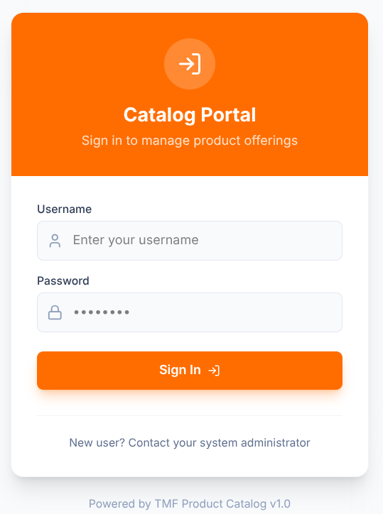
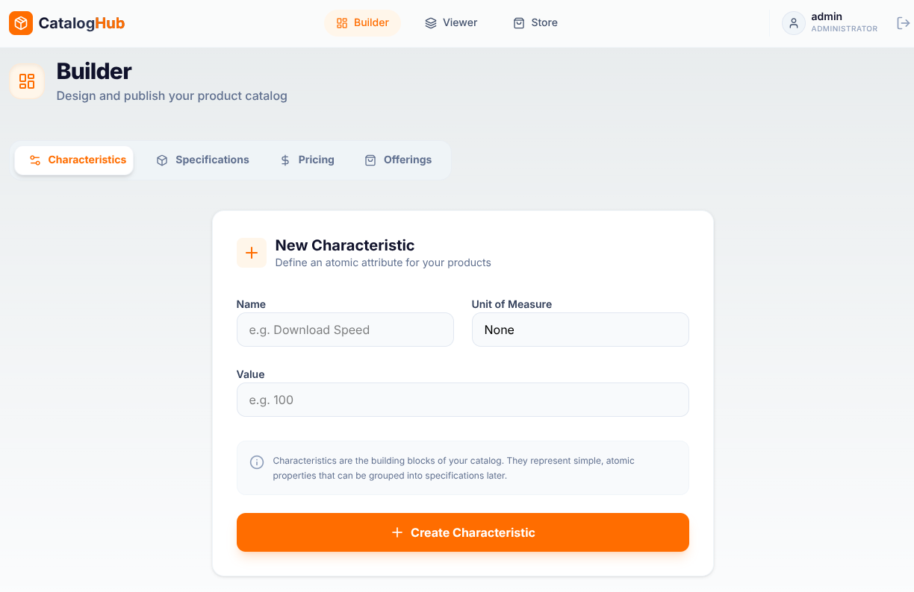
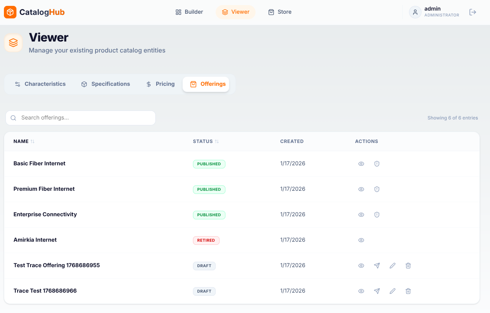
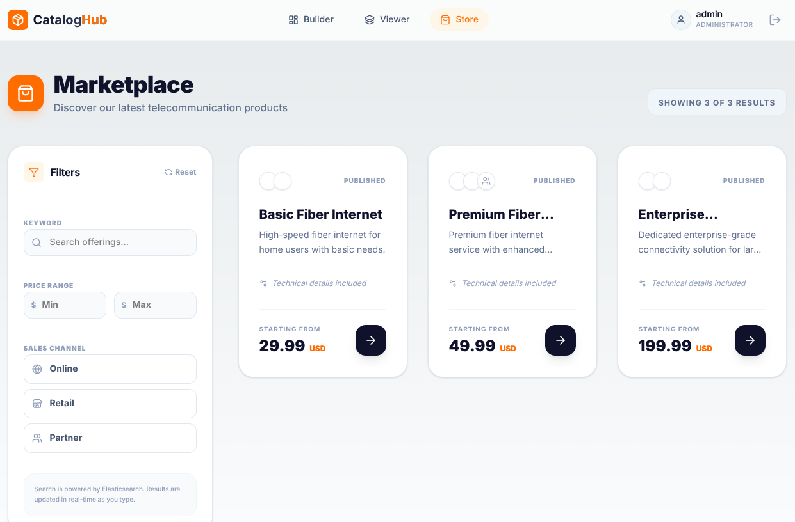
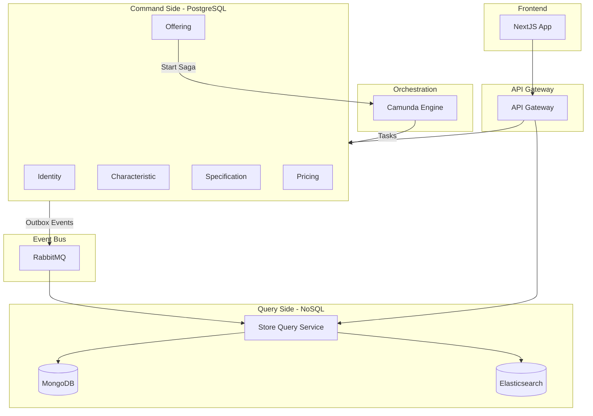
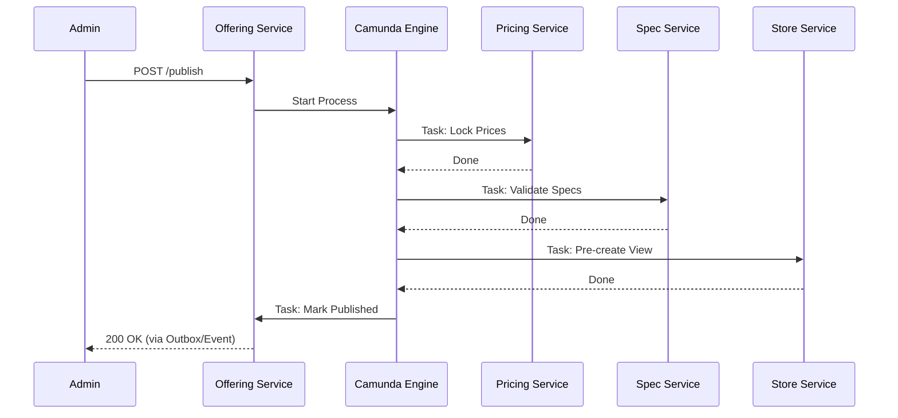
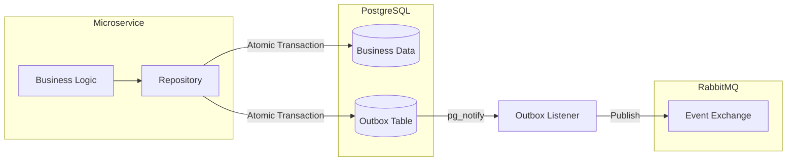

# TMF Product Catalog Microservices System

A cloud-native, event-driven microservices platform for managing telecommunications product catalogs. This project demonstrates high-scale architectural patterns including **Distributed Sagas**, **CQRS**, and **Transactional Outbox**.

**GitHub:** [https://github.com/amirkiarafiei/microservices-product-catalog](https://github.com/amirkiarafiei/microservices-product-catalog)

---

## Screenshots

<div align="center">
  
  &nbsp;&nbsp;&nbsp;
  
  <br/>
  
  &nbsp;&nbsp;&nbsp;
  
</div>

---

## Table of Contents

- [TMF Product Catalog Microservices System](#tmf-product-catalog-microservices-system)
  - [Table of Contents](#table-of-contents)
  - [🚀 Quick Start (Automated)](#-quick-start-automated)
    - [1. Infrastructure](#1-infrastructure)
    - [2. First-Time Setup](#2-first-time-setup)
    - [3. Running the App](#3-running-the-app)
    - [4. Management](#4-management)
    - [5. Dependency Management \& Testing](#5-dependency-management--testing)
  - [Default Credentials](#default-credentials)
  - [🕵️ Observability \& Monitoring](#️-observability--monitoring)
  - [🏗 Core Architecture Patterns](#-core-architecture-patterns)
  - [📊 System Visualizations](#-system-visualizations)
    - [1. High-Level Architecture](#1-high-level-architecture)
    - [2. Offering Publication Saga](#2-offering-publication-saga)
    - [3. Transactional Outbox Pattern](#3-transactional-outbox-pattern)
  - [📂 Microservices Map](#-microservices-map)
  - [Development Guide](#development-guide)
    - [Testing](#testing)
    - [Database Management](#database-management)
    - [Infrastructure](#infrastructure)
  - [Key Technologies](#key-technologies)
  - [📂 Project Structure](#-project-structure)
  - [URLs \& Ports](#urls--ports)
  - [📚 Project Documentation](#-project-documentation)
    - [Final Report](#final-report)
    - [API Reference](#api-reference)
    - [Design Documents](#design-documents)
  - [Contributing](#contributing)
    - [Code Style](#code-style)
    - [PR Process](#pr-process)
  - [License](#license)
  - [Contact](#contact)

---

## 🚀 Quick Start (Automated)

We use a `Makefile` to simplify monorepo orchestration.

### 1. Infrastructure

Spin up the databases and middleware:
```bash
make infra-up
```

### 2. First-Time Setup

Run these once to prepare security and databases:
```bash
make setup-keys  # Generate RSA keys
make migrate     # Apply DB schemas
```
*Note: Follow script instructions to update `services/identity-service/.env` after generating keys.*

### 3. Running the App

You can start everything with a single command:
```bash
make dev
```
- **Backend:** Starts 7 microservices in the background (logs saved to `logs/` directory).
- **Frontend:** Starts the Next.js dev server on [http://localhost:3000](http://localhost:3000).

### 4. Management

```bash
make status  # Check which services are running
make stop    # Stop all background backend services
make clean   # Remove logs and temp files
```

### 5. Dependency Management & Testing

```bash
make install-all-deps  # Install all backend (uv) and frontend (npm) deps
make test-all          # Run all tests across the monorepo
make lint-all          # Run linters (ruff + next lint)
```
---

## Default Credentials

| Role | Username | Password |
|------|----------|----------|
| Admin | `admin` | `admin` |
| User | `user` | `user` |

---

## 🕵️ Observability & Monitoring

The system is a "Glass Box" – you can see everything happening inside:

- **Zipkin (Tracing):** Visit [http://localhost:9411](http://localhost:9411) to see waterfall charts of every request hop.
- **Kibana (Logs):** Visit [http://localhost:5601](http://localhost:5601) to search logs by `correlation_id` across all services.
- **Camunda Cockpit:** Visit [http://localhost:8085](http://localhost:8085) to watch the Offering Publication Saga in real-time.
- **API Documentation:** Each service has interactive Swagger UI at `/docs` (e.g., [http://localhost:8000/docs](http://localhost:8000/docs))

---

## 🏗 Core Architecture Patterns

- **Hexagonal Architecture:** Domain logic is strictly isolated from infrastructure.
- **Orchestrated Saga:** Publication lifecycle managed by **Camunda BPMN** with automatic compensating transactions.
- **CQRS:** Separate write models (PostgreSQL) and read models (MongoDB + Elasticsearch).
- **Transactional Outbox:** Guaranteed event delivery using Postgres `LISTEN/NOTIFY`.
- **Zero-Trust Security:** Every service boundary validates JWTs signed with **RS256**.
- **Full Observability:** Distributed tracing with **OpenTelemetry** and centralized logging with **ELK**.

---

## 📊 System Visualizations

### 1. High-Level Architecture

The system is divided into a **Command Side** (Write) and a **Query Side** (Read), connected via asynchronous events.



### 2. Offering Publication Saga

A distributed transaction spanning four microservices, orchestrated by Camunda.



### 3. Transactional Outbox Pattern

Ensures that a database update and its corresponding event publication happen atomically.



---

## 📂 Microservices Map

| Service | Responsibility | Write DB | Read/Search |
|---------|-----------------|----------|-------------|
| **API Gateway** | Entry point, Circuit Breakers, Correlation IDs | - | - |
| **Identity** | Authentication & RSA Key Distribution | PostgreSQL | - |
| **Characteristic** | Atomic attributes (Speed, Color, etc.) | PostgreSQL | - |
| **Specification** | Technical groupings of characteristics | PostgreSQL | - |
| **Pricing** | Monetary definitions & Saga Locking | PostgreSQL | - |
| **Offering** | Product bundles & Saga Orchestrator | PostgreSQL | - |
| **Store Query** | High-performance catalog & Full-text search | - | Mongo + ES |
| **Web UI** | Modern Management & Shopping Portal | - | Next.js 16 |

---

##  Development Guide

### Testing

We maintain a high-quality bar with **108 tests** across the suite:

```bash
# Run tests for a specific service
cd services/pricing-service && uv run pytest tests -v

# Run shared library tests
cd libs/common-python && uv run pytest tests -v
```

### Database Management

**Migrate all services:**
```bash
make migrate
```

**Reset databases to clean state:**
```bash
uv run python scripts/clean_databases.py
```

**Seed sample data:**
```bash
uv run python scripts/seed_data.py
```

### Infrastructure

**Start all containers:**
```bash
make infra-up
```

**Stop all containers:**
```bash
make infra-down
```

**View container status:**
```bash
docker-compose ps
```

---

## Key Technologies

| Layer | Technology | Version |
|-------|-----------|---------|
| **Frontend** | Next.js | 16.1+ |
| **Frontend Styling** | Tailwind CSS | 4.0+ |
| **Backend** | Python | 3.13+ |
| **Framework** | FastAPI | 0.104+ |
| **Package Manager** | uv | Latest |
| **Write DB** | PostgreSQL | 15 |
| **Read DB** | MongoDB | 7 |
| **Search** | Elasticsearch | 8.11+ |
| **Message Broker** | RabbitMQ | 3.12 |
| **Workflow** | Camunda | 7.20 |
| **Tracing** | Zipkin | Latest |
| **Logging** | ELK Stack | 8.11+ |
| **Containers** | Docker Compose | Latest |


---

## 📂 Project Structure

```
microservices-product-catalog/
├── docs/                      # Complete documentation
│   ├── report/               # Final project report
│   ├── api/                  # API reference & OpenAPI specs
│   ├── sdd.md                # System Design Document
│   └── phases/               # Development roadmap
│
├── services/                 # Microservices
│   ├── api-gateway/          # Entry point :8000
│   ├── identity-service/     # Auth :8001
│   ├── characteristic-service/ # Characteristics :8002
│   ├── specification-service/  # Specifications :8003
│   ├── pricing-service/      # Pricing :8004
│   ├── offering-service/     # Offerings :8005
│   └── store-service/        # Store (CQRS Read) :8006
│
├── libs/common-python/       # Shared library
│   └── src/common/
│       ├── logging.py        # Structured logging
│       ├── tracing.py        # OpenTelemetry
│       ├── security.py       # JWT validation
│       ├── messaging.py      # RabbitMQ
│       └── exceptions.py     # Standard errors
│
├── web-ui/                   # Next.js frontend :3000
│   └── src/
│       ├── app/              # App Router pages
│       ├── components/       # Reusable UI
│       └── contexts/         # React contexts
│
├── scripts/                  # Development utilities
│   ├── migrate.py            # DB migrations
│   ├── seed_data.py          # Sample data
│   ├── clean_databases.py    # Reset DBs
│   └── generate_keys.sh      # RSA key generation
│
├── tests/                    # E2E tests
│   └── e2e/
│
├── docker-compose.yml        # Infrastructure
├── Makefile                  # Automation
├── pyproject.toml            # Root workspace
└── README.md                 # This file
```
---

## URLs & Ports

| Service | URL | Port |
|---------|-----|------|
| Web UI | [http://localhost:3000](http://localhost:3000) | 3000 |
| API Gateway | [http://localhost:8000](http://localhost:8000) | 8000 |
| API Docs | [http://localhost:8000/docs](http://localhost:8000/docs) | - |
| Identity | [http://localhost:8001](http://localhost:8001) | 8001 |
| Characteristic | [http://localhost:8002](http://localhost:8002) | 8002 |
| Specification | [http://localhost:8003](http://localhost:8003) | 8003 |
| Pricing | [http://localhost:8004](http://localhost:8004) | 8004 |
| Offering | [http://localhost:8005](http://localhost:8005) | 8005 |
| Store | [http://localhost:8006](http://localhost:8006) | 8006 |
| Camunda | [http://localhost:8085](http://localhost:8085) | 8085 |
| RabbitMQ | [http://localhost:15672](http://localhost:15672) | 15672 |
| Zipkin | [http://localhost:9411](http://localhost:9411) | 9411 |
| Kibana | [http://localhost:5601](http://localhost:5601) | 5601 |
| Elasticsearch | [http://localhost:9200](http://localhost:9200) | 9200 |
| PostgreSQL | localhost:5432 | 5432 |
| MongoDB | localhost:27017 | 27017 |

---

## 📚 Project Documentation

### Final Report

Complete project report with comprehensive technical analysis:

**[📖 Read Full Report](docs/report/report.md)**

**Contents:**
- Problem definition and project scope
- Requirements analysis (functional and non-functional)
- Analysis models (Use Cases, Domain Model, Activity Diagrams)
- Design models (Component, Sequence, State Machine Diagrams)
- Detailed architectural design and patterns
- Implementation details and decisions
- Testing strategy and results (108 test functions)
- Deployment instructions
- Evaluation, challenges, and future improvements

### API Reference

Complete API documentation with interactive endpoints:

**[📖 API Reference Guide](docs/api/API_REFERENCE.md)**

**Includes:**
- Authentication endpoints
- Characteristics, Specifications, Pricing, Offerings CRUD operations
- Store (public) catalog search
- Health checks
- Error responses with HTTP status codes
- Request/response examples for all endpoints
- Interactive Swagger documentation links

**OpenAPI Specifications:**
- [Gateway](docs/api/gateway-openapi.json)
- [Identity Service](docs/api/identity-openapi.json)
- [Characteristic Service](docs/api/characteristic-openapi.json)
- [Specification Service](docs/api/specification-openapi.json)
- [Pricing Service](docs/api/pricing-openapi.json)
- [Offering Service](docs/api/offering-openapi.json)
- [Store Service](docs/api/store-openapi.json)

### Design Documents

- **[System Design Document](docs/sdd.md)** - High-level architecture, bounded contexts, data flows
- **[Development Phases](docs/phases/phases.md)** - 21-phase incremental roadmap with completion status

---

## Contributing

### Code Style

- **Python:** Follow PEP 8 with `ruff` linter
- **TypeScript/React:** Use `prettier` and `eslint`
- **Commits:** Conventional commits format

### PR Process

1. Create feature branch: `git checkout -b feat/description`
2. Make changes and write tests
3. Run tests: `make test-all`
4. Push and open PR
5. Address review comments
6. Merge after approval

---

## License

This project is licensed under the MIT License - see the LICENSE file for details.

---

## Contact

For questions or contributions, please open an issue on [GitHub](https://github.com/amirkiarafiei/microservices-product-catalog).

---

*Last Updated: January 2026*
