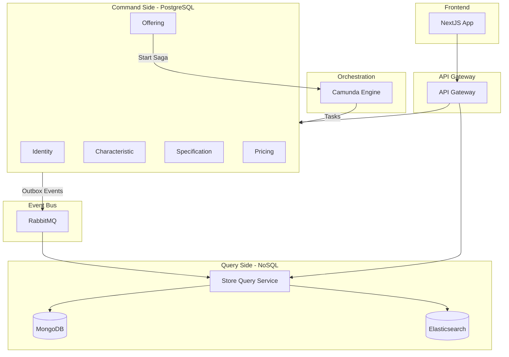
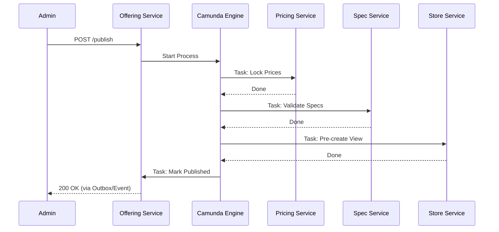
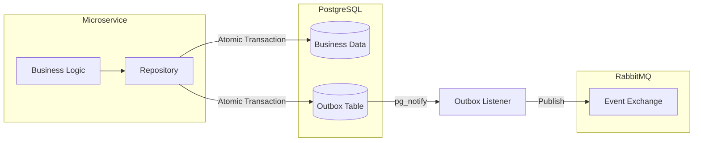

# TMF Product Catalog Microservices System

A cloud-native, event-driven microservices platform for managing telecommunications product catalogs. This project demonstrates high-scale architectural patterns including **Distributed Sagas**, **CQRS**, and **Transactional Outbox**.

---

## 🏗 Core Architecture Patterns

- **Hexagonal Architecture:** Domain logic is strictly isolated from infrastructure.
- **Orchestrated Saga:** Publication lifecycle managed by **Camunda BPMN** with automatic compensating transactions.
- **CQRS:** Separate write models (PostgreSQL) and read models (MongoDB + Elasticsearch).
- **Transactional Outbox:** Guaranteed event delivery using Postgres `LISTEN/NOTIFY`.
- **Zero-Trust Security:** Every service boundary validates JWTs signed with **RS256**.
- **Full Observability:** Distributed tracing with **OpenTelemetry** and centralized logging with **ELK**.

---

## 📊 System Visualizations

### 1. High-Level Architecture
The system is divided into a **Command Side** (Write) and a **Query Side** (Read), connected via asynchronous events.



### 2. Offering Publication Saga
A distributed transaction spanning four microservices, orchestrated by Camunda.



### 3. Transactional Outbox Pattern
Ensures that a database update and its corresponding event publication happen atomically.



---

## 📂 Microservices Map

| Service | Responsibility | Write DB | Read/Search |
| :--- | :--- | :--- | :--- |
| **API Gateway** | Entry point, Circuit Breakers, Correlation IDs | - | - |
| **Identity** | Authentication & RSA Key Distribution | PostgreSQL | - |
| **Characteristic**| Atomic attributes (Speed, Color, etc.) | PostgreSQL | - |
| **Specification** | Technical groupings of characteristics | PostgreSQL | - |
| **Pricing** | Monetary definitions & Saga Locking | PostgreSQL | - |
| **Offering** | Product bundles & Saga Orchestrator | PostgreSQL | - |
| **Store Query** | High-performance catalog & Full-text search | - | Mongo + ES |
| **Web UI** | Modern Management & Shopping Portal | - | Next.js 16 |

---

## 🚀 Quick Start (Automated)

We use a `Makefile` to simplify monorepo orchestration.

### 1. Infrastructure
Spin up the databases and middleware:
```bash
make infra-up
```

### 2. First-Time Setup
Run these once to prepare security and databases:
```bash
make setup-keys  # Generate RSA keys
make migrate     # Apply DB schemas
```
*Note: Follow script instructions to update `services/identity-service/.env` after generating keys.*

### 3. Running the App
You can start everything with a single command:
```bash
make dev
```
*   **Backend:** Starts 7 microservices in the background (logs saved to `logs-*.log`).
*   **Frontend:** Starts the Next.js dev server on [http://localhost:3000](http://localhost:3000).

### 4. Management
```bash
make status  # Check which services are running
make stop    # Stop all background backend services
```

---

## 🚀 Manual Execution (Alternative)

## 🕵️ Observability & Monitoring

The system is a "Glass Box" – you can see everything happening inside:

- **Zipkin (Tracing):** Visit [http://localhost:9411](http://localhost:9411) to see waterfall charts of every request hop.
- **Kibana (Logs):** Visit [http://localhost:5601](http://localhost:5601) to search logs by `correlation_id` across all services.
- **Camunda Cockpit:** Visit [http://localhost:8085](http://localhost:8085) to watch the Offering Publication Saga in real-time.

---

## 🧪 Testing

We maintain a high-quality bar with **98+ tests** across the suite:

```bash
# Run tests for a specific service
cd services/pricing-service && uv run pytest tests -v

# Run shared library tests
cd libs/common-python && uv run pytest tests -v
```

---

## 🗺 Implementation Progress

- [x] **Phase 1-10:** Core microservices and CQRS
- [x] **Phase 11:** API Gateway & Resilience
- [x] **Phase 12:** Distributed Transactions (Camunda Saga)
- [x] **Phase 13:** Observability (OTel + ELK)
- [x] **Phase 14:** UI Scaffold & Authentication (Next.js 16, Tailwind 4)
- [x] **Phase 15:** Admin UI - The Builder (Create Entities)
- [x] **Phase 16:** Admin UI - The Viewer (Manage Entities)
- [x] **Phase 17:** Customer UI - The Store & Saga Polling
- [ ] **Phase 18:** Final Polish & Deployment
