# TMF Product Catalog Microservices System
## Final Project Report

---

<div align="center">

### BLM5126 - Advanced Software Architecture
### Fall 2025-2026

---

**Student:** Amirkia Rafiei Oskooei  
**Student ID:** 25501002  
**Email:** amirkia.rafiei@std.yildiz.edu.tr  

**Lecturer:** Asst. Prof. Göksel BİRİCİK

**Yıldız Technical University**  
**Graduate School of Natural and Applied Sciences**

---

**GitHub Repository:** [https://github.com/amirkiarafiei/microservices-product-catalog](https://github.com/amirkiarafiei/microservices-product-catalog)

**Demo Video:** {to be shared}

**Date:** January 2026

</div>

---

## Table of Contents

- [TMF Product Catalog Microservices System](#tmf-product-catalog-microservices-system)
  - [Final Project Report](#final-project-report)
    - [BLM5126 - Advanced Software Architecture](#blm5126---advanced-software-architecture)
    - [Fall 2025-2026](#fall-2025-2026)
  - [Table of Contents](#table-of-contents)
  - [1. Introduction](#1-introduction)
    - [1.1 Problem Definition](#11-problem-definition)
    - [1.2 Project Scope](#12-project-scope)
    - [1.3 Objectives](#13-objectives)
  - [2. Requirements Analysis](#2-requirements-analysis)
    - [2.1 User Scenarios](#21-user-scenarios)
      - [Scenario 1: Admin Creates a Product Offering](#scenario-1-admin-creates-a-product-offering)
      - [Scenario 2: Customer Browses Catalog](#scenario-2-customer-browses-catalog)
      - [Scenario 3: Publication Failure \& Compensation](#scenario-3-publication-failure--compensation)
    - [2.2 Functional Requirements](#22-functional-requirements)
    - [2.3 Non-Functional Requirements](#23-non-functional-requirements)
  - [3. Analysis Model](#3-analysis-model)
    - [3.1 Use Case Diagram](#31-use-case-diagram)
    - [3.2 Domain Model](#32-domain-model)
    - [3.3 Activity Diagrams](#33-activity-diagrams)
      - [Offering Publication Flow](#offering-publication-flow)
  - [4. Design Model](#4-design-model)
    - [4.1 Component Diagram](#41-component-diagram)
    - [4.2 Sequence Diagrams](#42-sequence-diagrams)
      - [Create Characteristic with Outbox Pattern](#create-characteristic-with-outbox-pattern)
      - [Saga Orchestration Flow](#saga-orchestration-flow)
    - [4.3 State Machine Diagram](#43-state-machine-diagram)
      - [Product Offering Lifecycle](#product-offering-lifecycle)
  - [5. Architectural Design](#5-architectural-design)
    - [5.1 High-Level Architecture](#51-high-level-architecture)
    - [5.2 Microservices Decomposition](#52-microservices-decomposition)
    - [5.3 Design Patterns Applied](#53-design-patterns-applied)
      - [5.3.1 Transactional Outbox Pattern](#531-transactional-outbox-pattern)
      - [5.3.2 Saga Orchestration Pattern](#532-saga-orchestration-pattern)
      - [5.3.3 CQRS Pattern](#533-cqrs-pattern)
      - [5.3.4 Circuit Breaker Pattern](#534-circuit-breaker-pattern)
    - [5.4 Technology Stack](#54-technology-stack)
    - [5.5 Database Schemas](#55-database-schemas)
      - [Identity Database](#identity-database)
      - [Characteristic Database](#characteristic-database)
      - [Specification Database](#specification-database)
      - [Pricing Database](#pricing-database)
      - [Offering Database](#offering-database)
      - [Store Database (MongoDB)](#store-database-mongodb)
  - [6. Implementation Details](#6-implementation-details)
    - [6.1 Project Structure](#61-project-structure)
    - [6.2 Key Implementation Decisions](#62-key-implementation-decisions)
      - [Decision 1: Monorepo with uv Workspaces](#decision-1-monorepo-with-uv-workspaces)
      - [Decision 2: Postgres LISTEN/NOTIFY for Outbox](#decision-2-postgres-listennotify-for-outbox)
      - [Decision 3: External Task Workers for Saga](#decision-3-external-task-workers-for-saga)
      - [Decision 4: RS256 JWT with Local Keys](#decision-4-rs256-jwt-with-local-keys)
  - [7. Testing Strategy](#7-testing-strategy)
    - [7.1 Test Architecture](#71-test-architecture)
    - [7.2 Test Results](#72-test-results)
  - [8. Deployment](#8-deployment)
    - [8.1 Infrastructure Setup](#81-infrastructure-setup)
    - [8.2 Running the Application](#82-running-the-application)
  - [9. Evaluation \& Discussion](#9-evaluation--discussion)
    - [9.1 Achievements](#91-achievements)
    - [9.2 Challenges Faced](#92-challenges-faced)
    - [9.3 Future Improvements](#93-future-improvements)
  - [10. Conclusion](#10-conclusion)
  - [11. API Reference](#11-api-reference)
    - [Authentication](#authentication)
    - [Characteristics](#characteristics)
    - [Specifications](#specifications)
    - [Pricing](#pricing)
    - [Offerings](#offerings)
    - [Store (Public)](#store-public)
  - [12. References](#12-references)

---

## 1. Introduction

### 1.1 Problem Definition

Telecommunications companies face significant challenges in managing their product catalogs. A typical telecom product (e.g., an internet package) consists of:

- **Technical Specifications** (speed, bandwidth, storage)
- **Pricing Plans** (monthly fees, one-time charges)
- **Sales Channels** (online, retail, partner)

Managing these entities across multiple systems leads to:
- **Data Inconsistency:** Product information scattered across databases
- **Slow Time-to-Market:** Complex approval workflows for new products
- **Poor Scalability:** Monolithic systems cannot handle peak loads

This project implements a **TMForum-compliant Product Catalog** using modern microservices architecture to address these challenges.

### 1.2 Project Scope

The system provides:

1. **Resource Management:** Create and manage technical characteristics and specifications
2. **Commercial Management:** Define pricing with currency and unit support
3. **Product Lifecycle:** Bundle resources and pricing into offerings with full lifecycle control
4. **Customer Catalog:** High-performance, searchable store for published products

### 1.3 Objectives

| Objective | Description |
|-----------|-------------|
| **Demonstrate Microservices Patterns** | Implement decomposition by business capability |
| **Apply CQRS** | Separate read and write models for optimization |
| **Implement Saga Pattern** | Orchestrate distributed transactions with compensation |
| **Ensure Observability** | Full distributed tracing and centralized logging |
| **Build Modern UI** | Next.js 16 SPA with responsive design |

---

## 2. Requirements Analysis

### 2.1 User Scenarios

#### Scenario 1: Admin Creates a Product Offering

```
As an Admin,
I want to create a product offering with specifications and pricing,
So that customers can purchase it through the store.

Steps:
1. Create characteristics (e.g., Speed: 100 Mbps)
2. Create specification (e.g., "Fiber Optic Spec")
3. Create pricing (e.g., "$50/month")
4. Bundle into offering (e.g., "Premium Internet")
5. Publish offering (triggers saga workflow)
```

#### Scenario 2: Customer Browses Catalog

```
As a Customer,
I want to search and filter published products,
So that I can find the best offering for my needs.

Steps:
1. Visit store page
2. Search by keyword or filter by price range
3. View offering details (specs, pricing)
4. Compare multiple offerings
```

#### Scenario 3: Publication Failure & Compensation

```
As the System,
When a publication step fails,
I must automatically rollback all previous steps.

Steps:
1. Lock prices → Success
2. Validate specs → FAILURE
3. Automatically unlock prices (compensation)
4. Revert offering to DRAFT status
```

### 2.2 Functional Requirements

| ID | Requirement | Priority |
|----|-------------|----------|
| FR-01 | Admin can create/update/delete characteristics | High |
| FR-02 | Admin can create specifications with multiple characteristics | High |
| FR-03 | Admin can create pricing with currency and unit | High |
| FR-04 | Admin can create offerings combining specs and pricing | High |
| FR-05 | System validates cross-service dependencies | High |
| FR-06 | Admin can publish offerings (triggers saga) | High |
| FR-07 | Admin can retire published offerings | Medium |
| FR-08 | Customers can search offerings by keyword | High |
| FR-09 | Customers can filter by price range | Medium |
| FR-10 | System provides real-time publication status | Medium |

### 2.3 Non-Functional Requirements

| ID | Requirement | Metric |
|----|-------------|--------|
| NFR-01 | **Availability:** System handles service failures gracefully | Circuit breaker opens after 5 failures |
| NFR-02 | **Consistency:** Events are never lost | Transactional outbox guarantees delivery |
| NFR-03 | **Scalability:** Services scale independently | Database-per-service pattern |
| NFR-04 | **Security:** Zero-trust service boundaries | JWT validated at every service |
| NFR-05 | **Observability:** End-to-end request tracing | OpenTelemetry + Zipkin |
| NFR-06 | **Performance:** Store queries < 200ms | Elasticsearch indexing |
| NFR-07 | **Maintainability:** Clean code separation | Hexagonal architecture |

---

## 3. Analysis Model

### 3.1 Use Case Diagram

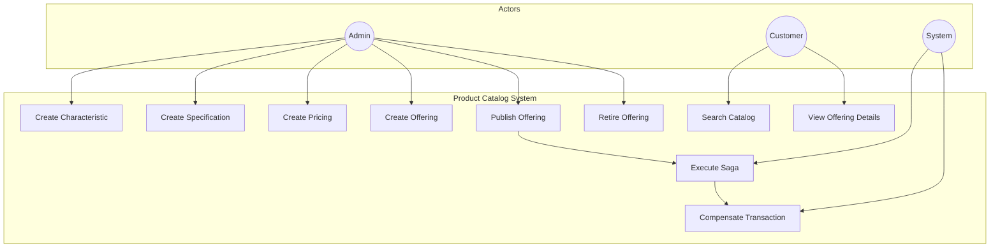

### 3.2 Domain Model

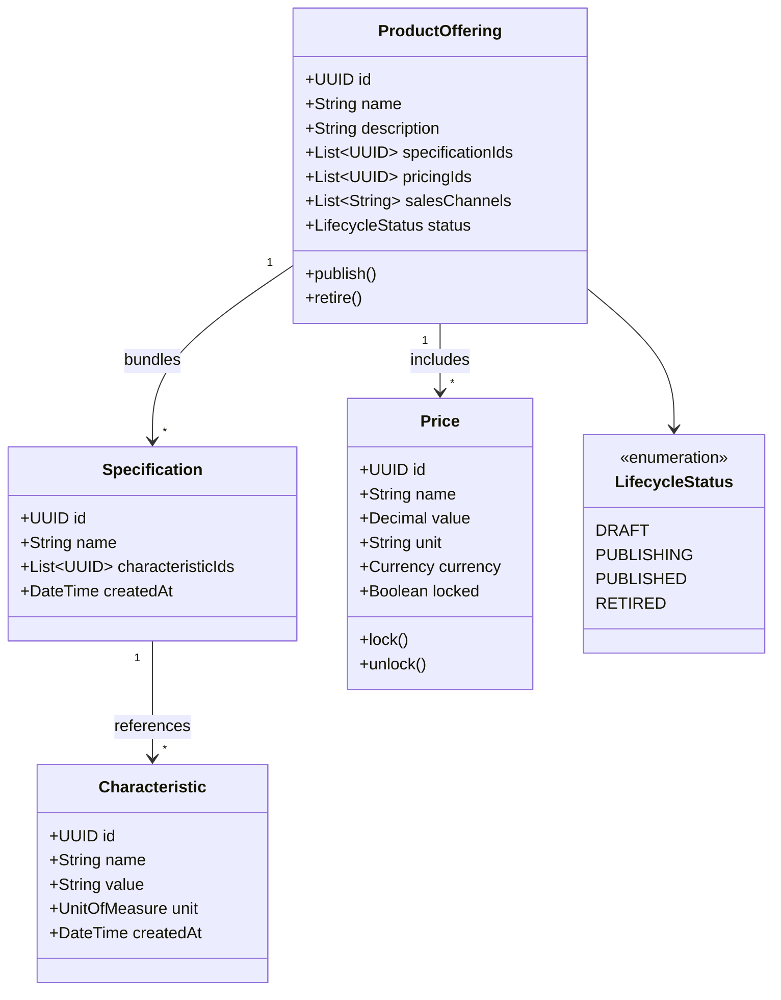

### 3.3 Activity Diagrams

#### Offering Publication Flow

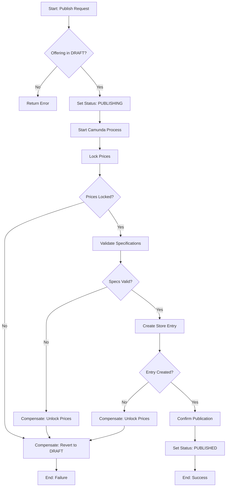

---

## 4. Design Model

### 4.1 Component Diagram

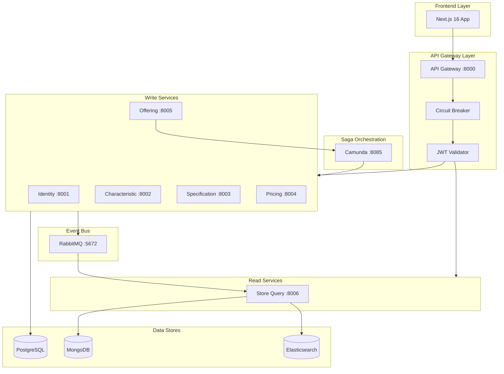

### 4.2 Sequence Diagrams

#### Create Characteristic with Outbox Pattern

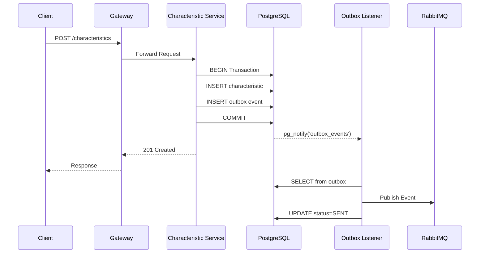

#### Saga Orchestration Flow

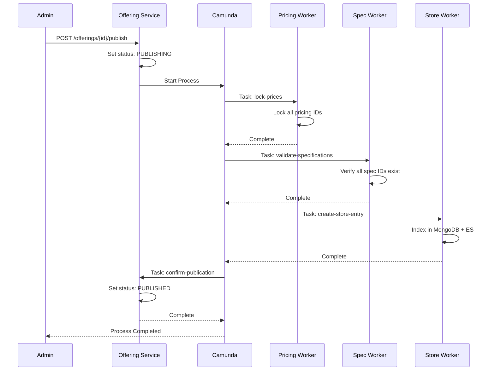

### 4.3 State Machine Diagram

#### Product Offering Lifecycle

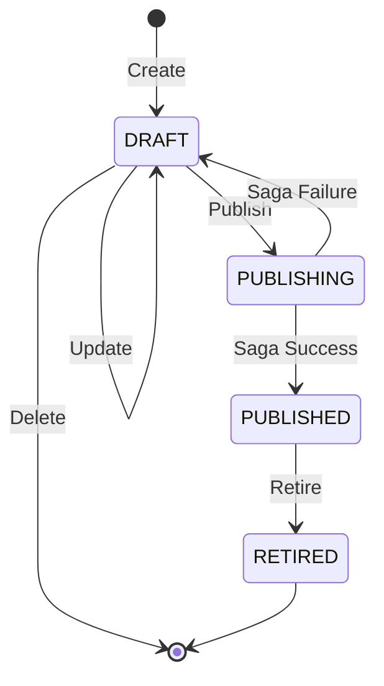

---

## 5. Architectural Design

### 5.1 High-Level Architecture

The system follows an **Event-Driven Microservices Architecture** with **CQRS** pattern:

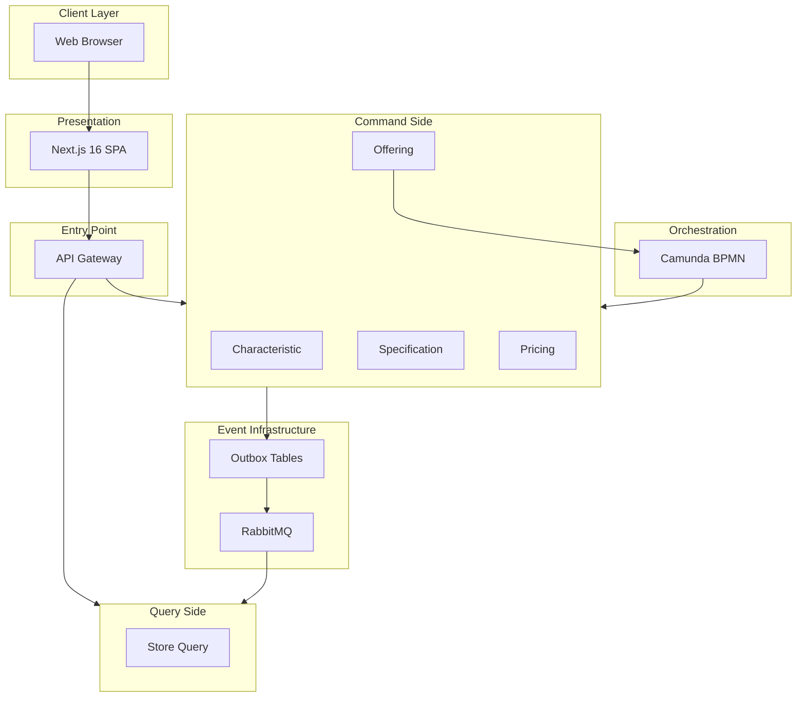

### 5.2 Microservices Decomposition

Services are decomposed by **Bounded Context** following Domain-Driven Design:

| Service | Bounded Context | Responsibility | Database |
|---------|-----------------|----------------|----------|
| **Identity** | Identity Context | Authentication, JWT issuance | PostgreSQL |
| **Characteristic** | Resource Context | Atomic product attributes | PostgreSQL |
| **Specification** | Resource Context | Technical groupings | PostgreSQL |
| **Pricing** | Commercial Context | Monetary definitions | PostgreSQL |
| **Offering** | Product Context | Product bundles + Saga orchestrator | PostgreSQL |
| **Store Query** | Sales Context | Read-optimized catalog | MongoDB + ES |
| **API Gateway** | Cross-Cutting | Routing, security, resilience | - |

### 5.3 Design Patterns Applied

#### 5.3.1 Transactional Outbox Pattern

**Problem:** How to atomically update the database AND publish an event?

**Solution:** Write the event to an outbox table in the same transaction, then a background listener publishes it.

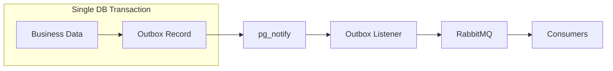

**Implementation:**
- PostgreSQL `LISTEN/NOTIFY` triggers instant delivery
- Outbox listener marks records as `SENT` after publishing
- Guarantees at-least-once delivery

#### 5.3.2 Saga Orchestration Pattern

**Problem:** How to maintain consistency across multiple services?

**Solution:** Use Camunda BPMN to orchestrate distributed transactions with compensation.

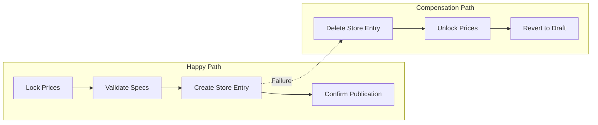

**Implementation:**
- External Task Workers poll Camunda for work
- Each worker handles one saga step
- BPMN defines compensation flow

#### 5.3.3 CQRS Pattern

**Problem:** Read and write operations have different requirements.

**Solution:** Separate write model (PostgreSQL) from read model (MongoDB + Elasticsearch).

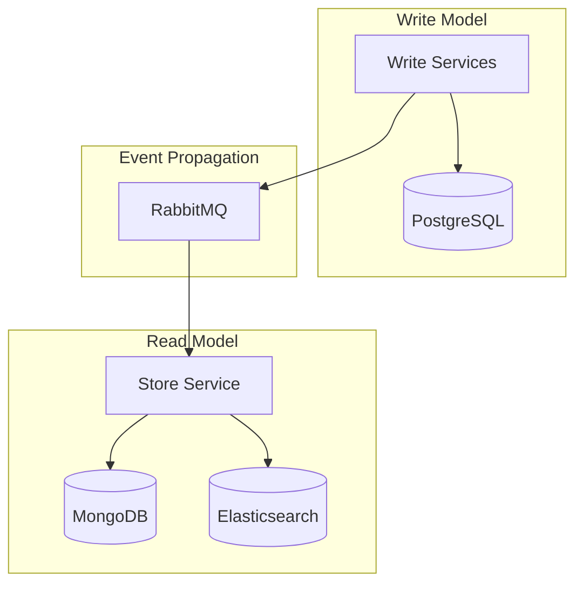

**Benefits:**
- Write: ACID transactions, normalized data
- Read: Denormalized documents, full-text search

#### 5.3.4 Circuit Breaker Pattern

**Problem:** How to prevent cascading failures?

**Solution:** API Gateway implements circuit breakers per downstream service.

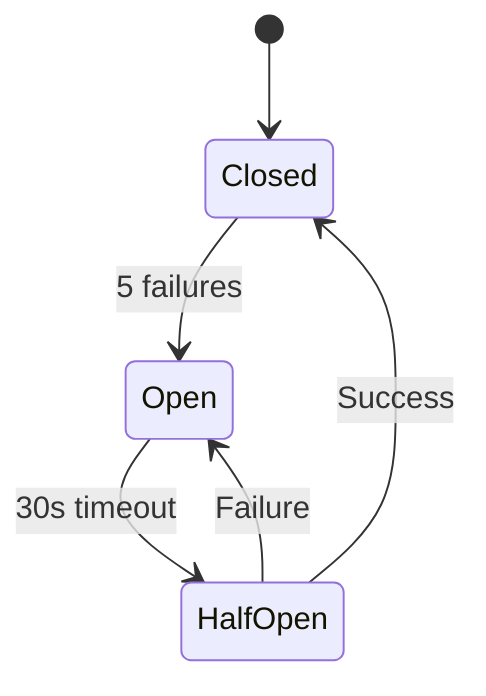

**Configuration:**
- `fail_max`: 5 consecutive failures
- `reset_timeout`: 30 seconds

### 5.4 Technology Stack

| Layer | Technology | Justification |
|-------|------------|---------------|
| **Frontend** | Next.js 16, React 19 | Server components, App Router |
| **Styling** | Tailwind CSS 4 | Utility-first, rapid development |
| **Backend** | Python 3.13, FastAPI | Async support, auto-documentation |
| **Package Manager** | uv | Fast, workspace support for monorepo |
| **Write DB** | PostgreSQL 15 | ACID, LISTEN/NOTIFY for outbox |
| **Read DB** | MongoDB 7 | Document store for denormalized views |
| **Search** | Elasticsearch 8 | Full-text search, aggregations |
| **Message Broker** | RabbitMQ 3.12 | Reliable delivery, dead-letter queues |
| **Workflow** | Camunda 7 | BPMN orchestration, external tasks |
| **Tracing** | Zipkin | OpenTelemetry B3 propagation |
| **Logging** | ELK Stack | Centralized log aggregation |
| **Containers** | Docker Compose | Development orchestration |

### 5.5 Database Schemas

#### Identity Database

```sql
CREATE TABLE users (
    id UUID PRIMARY KEY,
    username VARCHAR(100) NOT NULL UNIQUE,
    password_hash VARCHAR(255) NOT NULL,
    role VARCHAR(20) NOT NULL,  -- 'ADMIN' or 'USER'
    created_at TIMESTAMP
);
```

#### Characteristic Database

```sql
CREATE TABLE characteristics (
    id UUID PRIMARY KEY,
    name VARCHAR(200) NOT NULL UNIQUE,
    value VARCHAR(100) NOT NULL,
    unit_of_measure VARCHAR(20) NOT NULL,  -- ENUM
    created_at TIMESTAMP,
    updated_at TIMESTAMP
);

CREATE TABLE outbox (
    id UUID PRIMARY KEY,
    topic VARCHAR(255) NOT NULL,
    payload JSON NOT NULL,
    status VARCHAR(20) DEFAULT 'PENDING',
    created_at TIMESTAMP,
    processed_at TIMESTAMP
);
```

#### Specification Database

```sql
CREATE TABLE specifications (
    id UUID PRIMARY KEY,
    name VARCHAR(200) NOT NULL UNIQUE,
    characteristic_ids UUID[] NOT NULL,
    created_at TIMESTAMP,
    updated_at TIMESTAMP
);

CREATE TABLE cached_characteristics (
    id UUID PRIMARY KEY,
    name VARCHAR(200),
    last_updated_at TIMESTAMP
);
```

#### Pricing Database

```sql
CREATE TABLE prices (
    id UUID PRIMARY KEY,
    name VARCHAR(200) NOT NULL UNIQUE,
    value NUMERIC(10,2) NOT NULL,
    unit VARCHAR(50) NOT NULL,
    currency VARCHAR(3) NOT NULL,  -- USD, EUR, TRY
    locked BOOLEAN DEFAULT FALSE,
    locked_by_saga_id UUID,
    created_at TIMESTAMP,
    updated_at TIMESTAMP
);
```

#### Offering Database

```sql
CREATE TABLE product_offerings (
    id UUID PRIMARY KEY,
    name VARCHAR(200) NOT NULL,
    description VARCHAR(500),
    specification_ids UUID[] NOT NULL,
    pricing_ids UUID[] NOT NULL,
    sales_channels VARCHAR[] NOT NULL,
    lifecycle_status VARCHAR(20) NOT NULL,  -- DRAFT, PUBLISHING, PUBLISHED, RETIRED
    created_at TIMESTAMP,
    updated_at TIMESTAMP,
    published_at TIMESTAMP,
    retired_at TIMESTAMP
);
```

#### Store Database (MongoDB)

```javascript
// Collection: offerings
{
    "_id": "uuid",
    "name": "Premium Internet",
    "description": "High-speed fiber optic",
    "specifications": [{
        "id": "uuid",
        "name": "Fiber Optic Spec",
        "characteristics": [{
            "name": "Speed",
            "value": "100",
            "unit": "MBPS"
        }]
    }],
    "pricing": [{
        "id": "uuid",
        "name": "Monthly Fee",
        "value": 50.00,
        "currency": "USD"
    }],
    "sales_channels": ["online", "retail"],
    "published_at": "2026-01-18T00:00:00Z"
}
```

---

## 6. Implementation Details

### 6.1 Project Structure

```
microservices-product-catalog/
├── docker-compose.yml          # Infrastructure orchestration
├── Makefile                    # Build automation
├── pyproject.toml              # Root workspace config
│
├── docs/                       # Documentation
│   ├── sdd.md                  # System Design Document
│   ├── phases.md               # Development roadmap
│   └── report/                 # This report
│
├── libs/
│   └── common-python/          # Shared library
│       └── src/common/
│           ├── logging.py      # Structured JSON logging
│           ├── tracing.py      # OpenTelemetry setup
│           ├── security.py     # JWT validation
│           ├── messaging.py    # RabbitMQ publisher
│           └── exceptions.py   # Standard errors
│
├── services/
│   ├── api-gateway/            # Entry point
│   ├── identity-service/       # Authentication
│   ├── characteristic-service/ # Resource context
│   ├── specification-service/  # Resource context
│   ├── pricing-service/        # Commercial context
│   ├── offering-service/       # Product context + Saga
│   └── store-service/          # CQRS read side
│
├── web-ui/                     # Next.js frontend
│   └── src/
│       ├── app/                # App Router pages
│       ├── components/         # Reusable UI
│       └── contexts/           # React contexts
│
├── scripts/                    # Utilities
│   ├── migrate.py              # Database migrations
│   ├── seed_data.py            # Sample data
│   └── clean_databases.py      # Reset databases
│
└── tests/
    └── e2e/                    # End-to-end tests
```

### 6.2 Key Implementation Decisions

#### Decision 1: Monorepo with uv Workspaces

**Rationale:** Enables sharing code (common-python) while maintaining service independence. Single `uv sync` installs all dependencies.

#### Decision 2: Postgres LISTEN/NOTIFY for Outbox

**Rationale:** Instead of polling, use database triggers for instant event detection. Reduces latency from seconds to milliseconds.

#### Decision 3: External Task Workers for Saga

**Rationale:** Decouples saga steps from Camunda. Workers run independently and can be scaled per service.

#### Decision 4: RS256 JWT with Local Keys

**Rationale:** Asymmetric signing allows services to verify tokens without shared secrets. Public key distributed via Identity Service.

---

## 7. Testing Strategy

### 7.1 Test Architecture

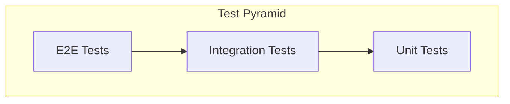

| Level | Scope | Tools | Count |
|-------|-------|-------|-------|
| **Unit** | Domain logic, business rules | pytest, unittest.mock | ~70 |
| **Integration** | Database, external services | pytest, testcontainers | ~25 |
| **Component** | Full service API | httpx.AsyncClient | ~10 |
| **E2E** | Saga workflows | pytest + live services | ~3 |

### 7.2 Test Results

```
Total Test Functions: 108

By Service:
├── common-python:        15 tests ✓
├── characteristic-service: 18 tests ✓
├── specification-service: 20 tests ✓
├── pricing-service:      22 tests ✓
├── offering-service:     15 tests ✓
├── store-service:        12 tests ✓
└── e2e:                   6 tests ✓
```

**Sample Test Output:**
```
========================= test session starts =========================
platform linux -- Python 3.13.1, pytest-8.3.5
collected 22 items

tests/unit/test_pricing_domain.py::test_create_price_valid PASSED
tests/unit/test_pricing_domain.py::test_price_lock PASSED
tests/unit/test_pricing_domain.py::test_price_unlock PASSED
tests/integration/test_pricing_repository.py::test_create_and_retrieve PASSED
tests/component/test_pricing_api.py::test_crud_operations PASSED

========================= 22 passed in 4.52s =========================
```

---

## 8. Deployment

### 8.1 Infrastructure Setup

**Prerequisites:**
- Docker & Docker Compose
- Node.js 20+ (for frontend)
- Python 3.13+ with `uv`

**Start Infrastructure:**
```bash
# Start all containers (Postgres, RabbitMQ, MongoDB, ES, Camunda, Zipkin, ELK)
make infra-up
```

### 8.2 Running the Application

```bash
# 1. Generate RSA keys (first time only)
make setup-keys

# 2. Apply database migrations
make migrate

# 3. Start all services + frontend
make dev

# 4. Open browser
# Frontend: http://localhost:3000
# API Docs: http://localhost:8000/docs
# Camunda:  http://localhost:8085
# Zipkin:   http://localhost:9411
```

**Default Credentials:**
- Admin: `admin` / `admin`
- User: `user` / `user`

---

## 9. Evaluation & Discussion

### 9.1 Achievements

| Goal | Status | Evidence |
|------|--------|----------|
| Microservices decomposition | ✅ Achieved | 7 independent services |
| CQRS pattern | ✅ Achieved | Write (Postgres) / Read (Mongo+ES) |
| Saga orchestration | ✅ Achieved | Camunda BPMN with compensation |
| Transactional outbox | ✅ Achieved | pg_notify triggers |
| Zero-trust security | ✅ Achieved | JWT validation at all services |
| Full observability | ✅ Achieved | Zipkin traces + ELK logs |
| Modern frontend | ✅ Achieved | Next.js 16 with Tailwind |
| Comprehensive tests | ✅ Achieved | 108 test functions |

### 9.2 Challenges Faced

| Challenge | Solution |
|-----------|----------|
| **Async Event Loop Conflicts** | Refactored tests to use `httpx.AsyncClient` with `pytest-asyncio` |
| **Saga Worker Blocking** | Isolated workers from FastAPI lifespan into separate modules |
| **React Hydration Mismatch** | Added `isMounted` state for SSR-safe client components |
| **Cross-Service Validation** | Implemented local characteristic cache with event sync |
| **Trace Context Propagation** | OpenTelemetry `instrument_httpx()` for B3 header injection |

### 9.3 Future Improvements

| Improvement | Description | Priority |
|-------------|-------------|----------|
| **Kubernetes Deployment** | Helm charts for production deployment | High |
| **API Versioning** | Support multiple API versions simultaneously | Medium |
| **Rate Limiting** | Prevent API abuse at gateway level | Medium |
| **GraphQL Gateway** | Single query for nested resources | Low |
| **Event Sourcing** | Full audit trail with event replay | Low |
| **Multi-Tenancy** | Support multiple organizations | Low |

---

## 10. Conclusion

This project successfully demonstrates a **production-grade microservices architecture** for a telecommunications product catalog system. Key accomplishments include:

1. **Clean Architecture:** Domain logic isolated from infrastructure concerns
2. **Distributed Transactions:** Saga pattern ensures data consistency
3. **Event-Driven Design:** Transactional outbox guarantees reliable messaging
4. **High Performance:** CQRS with Elasticsearch enables sub-200ms queries
5. **Full Observability:** End-to-end tracing across all services
6. **Modern UI:** Responsive Next.js application with real-time updates

The system is **horizontally scalable**, **resilient to failures**, and follows **industry best practices** for cloud-native applications.

---

## 11. API Reference

### Authentication

| Endpoint | Method | Description |
|----------|--------|-------------|
| `/api/v1/auth/login` | POST | Login with username/password |
| `/api/v1/auth/public-key` | GET | Get JWT public key |

### Characteristics

| Endpoint | Method | Auth | Description |
|----------|--------|------|-------------|
| `/api/v1/characteristics` | GET | USER | List all |
| `/api/v1/characteristics` | POST | ADMIN | Create |
| `/api/v1/characteristics/{id}` | GET | USER | Get by ID |
| `/api/v1/characteristics/{id}` | PUT | ADMIN | Update |
| `/api/v1/characteristics/{id}` | DELETE | ADMIN | Delete |

### Specifications

| Endpoint | Method | Auth | Description |
|----------|--------|------|-------------|
| `/api/v1/specifications` | GET | USER | List all |
| `/api/v1/specifications` | POST | ADMIN | Create |
| `/api/v1/specifications/{id}` | GET | USER | Get by ID |
| `/api/v1/specifications/{id}` | PUT | ADMIN | Update |
| `/api/v1/specifications/{id}` | DELETE | ADMIN | Delete |

### Pricing

| Endpoint | Method | Auth | Description |
|----------|--------|------|-------------|
| `/api/v1/prices` | GET | USER | List all |
| `/api/v1/prices` | POST | ADMIN | Create |
| `/api/v1/prices/{id}` | GET | USER | Get by ID |
| `/api/v1/prices/{id}` | PUT | ADMIN | Update |
| `/api/v1/prices/{id}` | DELETE | ADMIN | Delete |
| `/api/v1/prices/{id}/lock` | POST | ADMIN | Lock (Saga) |
| `/api/v1/prices/{id}/unlock` | POST | ADMIN | Unlock (Saga) |

### Offerings

| Endpoint | Method | Auth | Description |
|----------|--------|------|-------------|
| `/api/v1/offerings` | GET | USER | List all |
| `/api/v1/offerings` | POST | ADMIN | Create |
| `/api/v1/offerings/{id}` | GET | USER | Get by ID |
| `/api/v1/offerings/{id}` | PUT | ADMIN | Update |
| `/api/v1/offerings/{id}` | DELETE | ADMIN | Delete |
| `/api/v1/offerings/{id}/publish` | POST | ADMIN | Publish (Saga) |
| `/api/v1/offerings/{id}/retire` | POST | ADMIN | Retire |

### Store (Public)

| Endpoint | Method | Auth | Description |
|----------|--------|------|-------------|
| `/api/v1/store/offerings` | GET | None | Search offerings |
| `/api/v1/store/offerings/{id}` | GET | None | Get by ID |

**Query Parameters for Store Search:**
- `query`: Full-text search
- `min_price`, `max_price`: Price range filter
- `skip`, `limit`: Pagination

---

## 12. References

1. TMForum Open APIs - Product Catalog Management API (TMF620)
2. Richardson, C. (2018). *Microservices Patterns*. Manning Publications.
3. Evans, E. (2003). *Domain-Driven Design*. Addison-Wesley.
4. Hohpe, G. & Woolf, B. (2003). *Enterprise Integration Patterns*. Addison-Wesley.
5. FastAPI Documentation - https://fastapi.tiangolo.com/
6. Next.js Documentation - https://nextjs.org/docs
7. Camunda Documentation - https://docs.camunda.org/
8. OpenTelemetry Documentation - https://opentelemetry.io/docs/

---

<div align="center">

**End of Report**

*TMF Product Catalog Microservices System*  
*Advanced Software Architecture - BLM5126*  
*January 2026*

</div>
