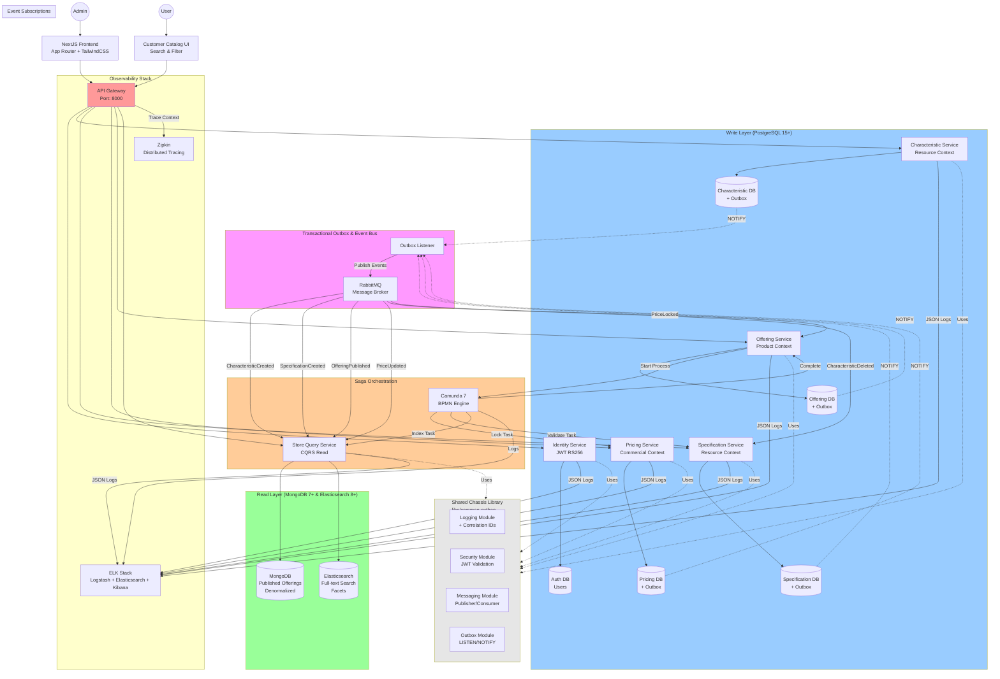

# High-Level System Design Document
## TMF Product Catalog Microservices System

**Project:** BLM5126 Term Project  
**Architecture:** Event-Driven Microservices with CQRS & Saga  
**Stack:** Python (FastAPI), NextJS, Docker, Kubernetes

---

### 1. Executive Summary
This project is a cloud-native application designed to demonstrate advanced microservice patterns. It implements a **Telecommunications Product Catalog**, allowing administrators to define technical resources and pricing, bundle them into product offerings, and publish them to a customer-facing store.

The system enforces a strict separation of concerns using **Domain-Driven Design (DDD)**, ensures data consistency via **Distributed Sagas**, and optimizes read performance using **CQRS**.

---

### 2. System Architecture

The system follows a **Hexagonal Architecture** within a **Monorepo**, orchestrated by Docker Compose.

---

### 3. Microservice Decomposition

The system is composed of 6 autonomous services:

| Service | Type | Responsibility & Pattern |
| :--- | :--- | :--- |
| **Identity Service** | Utility | **Authentication.** Issues and validates JWTs (RS256). Implements Zero Trust security. |
| **Characteristic Service** | Write | **Resource Context.** Manages atomic attributes (e.g., "Internet Speed", "Color"). Uses Outbox Pattern. |
| **Specification Service** | Write | **Resource Context.** Groups characteristics into technical specs. Validates dependencies synchronously. |
| **Pricing Service** | Write | **Commercial Context.** Manages monetary definitions. Supports "Locking" during active Sagas. |
| **Offering Service** | Write | **Product Context (Aggregate Root).** Bundles Specs + Prices. **Saga Orchestrator** for publication lifecycle. |
| **Store Query Service** | Read | **Sales Context (CQRS View).** Consumes events to build a read-optimized, searchable catalog (Elasticsearch/Mongo). |

---

### 4. Key Functional Requirements

#### 4.1 Product Builder (Admin)
*   **Define Resources:** Create Characteristics (e.g., "Bandwidth") and Specifications (e.g., "Fiber Optic Spec").
*   **Define Commercials:** Create Price plans (e.g., "$50/month").
*   **Bundle Offering:** Create a "Product Offering" (Draft Mode) linking Specs and Prices.
*   **Publishing Lifecycle:** Admin clicks "Publish". The system must validate integrity across services before making it live.

#### 4.2 Product Viewer (Admin/Customer)
*   **Catalog Browsing:** Users can view published products with sub-second latency.
*   **Advanced Search:** Filter products by dynamic characteristics (e.g., "Show me plans with Speed > 100Mbps").
*   **Detail View:** See full product hierarchy (Offering → Spec → Characteristic) in a single view.

---

### 5. Technical & Non-Functional Requirements

1.  **Data Consistency:**
    *   **Transactional Outbox:** No dual-write issues. Database updates and Event publishing happen atomically using Postgres `LISTEN/NOTIFY`.
    *   **Saga Pattern:** Orchestration via **Camunda**. If an offering fails validation during publishing, all changes (e.g., Price locks) are rolled back.

2.  **Resilience:**
    *   **Circuit Breaker:** The API Gateway stops traffic to failing services to prevent cascading outages.
    *   **Statelessness:** Services can be horizontally scaled (demonstrated via Docker replicas).

3.  **Observability:**
    *   **Distributed Tracing:** Every request carries a `Correlation-ID`. Traces are visualized in **Zipkin**.
    *   **Centralized Logging:** JSON logs aggregated in **ELK Stack**.

---

### 6. Technology Stack

*   **Frontend:** NextJS 14 (App Router), TailwindCSS.
*   **Backend:** Python 3.12, FastAPI, `uv` package manager.
*   **Databases:** PostgreSQL 15 (Write), MongoDB/Elasticsearch (Read).
*   **Messaging:** RabbitMQ (Events), Camunda 7 (Workflow).
*   **Infrastructure:** Docker Compose (Dev), Kubernetes (Arch-ready).

---

### 7. Data Flow Examples

**Scenario A: Creating a Characteristic**
1.  Frontend POSTs to Gateway → Characteristic Service.
2.  Service saves to Postgres & inserts 'Event' to Outbox table (Atomic Transaction).
3.  Background Listener detects Outbox insert → Publishes `CharacteristicCreated` to RabbitMQ.
4.  Store Service consumes event → Updates Read-Database.

**Scenario B: Publishing an Offering (The Saga)**
1.  Frontend POSTs "Publish" to Offering Service.
2.  Offering Service starts **Camunda Process**.
3.  **Step 1:** Pricing Service locks the price (via Worker).
4.  **Step 2:** Spec Service validates dependencies (via Worker).
5.  **Step 3:** Store Service pre-creates the view (via Worker).
6.  **Step 4:** Offering Service sets status to `PUBLISHED`.

---

### 8. Deliverables
1.  **Source Code:** Monorepo containing all 6 services + UI.
2.  **Documentation:** This Design Doc + API Specs.
3.  **Demo Video:** 5-minute walkthrough of the "Publishing Saga" and "Store Search."