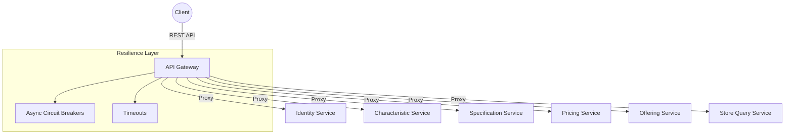

# API Gateway

## Overview
The API Gateway serves as the single entry point for all client requests to the TMF Product Catalog microservices. It handles routing, resilience (circuit breakers and timeouts), and cross-cutting concerns like Correlation ID tracking and CORS.

## Key Features
- **Unified Routing:** Proxies requests to Identity, Characteristic, Specification, Pricing, Offering, and Store services.
- **Resilience:**
  - **Circuit Breakers:** Uses a custom `AsyncCircuitBreaker` to prevent cascading failures. Configured with a failure threshold of 3 and a reset timeout of 20 seconds.
  - **Timeouts:** Enforces connection (2s) and read (4s) timeouts on all downstream requests.
- **Observability:**
  - **Correlation ID:** Generates or forwards `X-Correlation-ID` for end-to-end request tracing.
  - **Process Time:** Adds `X-Process-Time` to response headers.
- **Security:** Configurable CORS allowed origins.

## Architecture



## Tech Stack
- **Language:** Python 3.13+
- **Framework:** FastAPI
- **HTTP Client:** `httpx` (Asynchronous)
- **Resilience:** Custom Async Circuit Breaker
- **Logging:** Structured JSON logging via `common-python`

## Configuration
Settings are managed via Pydantic Settings in `gateway/config.py`.

| Setting | Default | Description |
| :--- | :--- | :--- |
| `PORT` | 8000 | Gateway listening port |
| `CONNECTION_TIMEOUT` | 2.0 | Connection timeout in seconds |
| `READ_TIMEOUT` | 4.0 | Read timeout in seconds |
| `CB_FAILURE_THRESHOLD` | 3 | Failures before circuit opens |
| `CB_RESET_TIMEOUT` | 20.0 | Time before attempting to close circuit |

## API Endpoints
- `/api/v1/auth/*` -> Identity Service
- `/api/v1/characteristics/*` -> Characteristic Service
- `/api/v1/specifications/*` -> Specification Service
- `/api/v1/prices/*` -> Pricing Service
- `/api/v1/offerings/*` -> Offering Service
- `/api/v1/store/*` -> Store Query Service
- `GET /health` -> Gateway health status
- `GET /health/dependencies` -> Detailed status of all downstream services and circuit breakers

## Local Development

**Via Root Makefile:**
```bash
make dev
```

**Manual:**
```bash
cd services/api-gateway
uv run uvicorn gateway.main:app --port 8000
```
