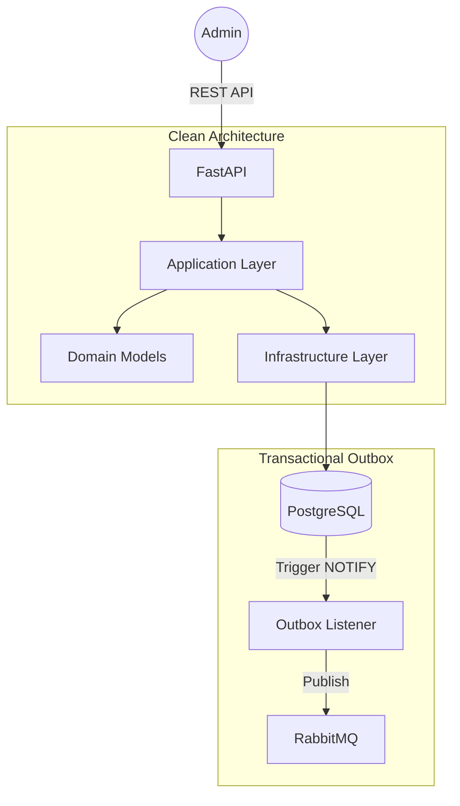

# Characteristic Service

The **Characteristic Service** manages atomic product attributes (e.g., "Internet Speed", "Data Cap"). It is a core write-side service following **Clean Architecture** and ensures data integrity via the **Transactional Outbox** pattern.

## Architecture



## Tech Stack
- **Language:** Python 3.12+
- **Framework:** FastAPI
- **ORM:** SQLAlchemy 2.0
- **Messaging:** `aio-pika` (RabbitMQ)
- **Database:** PostgreSQL
- **Migrations:** Alembic

## Key Patterns
- **Clean Architecture:** Strict separation between Domain, Application, and Infrastructure.
- **Transactional Outbox:** Guaranteed "at-least-once" event delivery using Postgres LISTEN/NOTIFY.
- **Service Autonomy:** Manages its own schema and background relay worker.

## Local Development

**Via Root Makefile:**
```bash
make dev
```

**Manual:**
```bash
cd services/characteristic-service
uv run uvicorn src.main:app --port 8002
```
