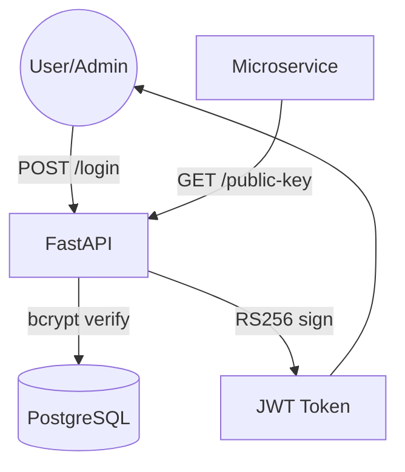

# Identity Service

The **Identity Service** is the central authentication authority for the TMF Product Catalog system. It implements a **Zero Trust** security model by issuing RS256-signed JWT tokens that other services validate independently.

## Architecture

## Tech Stack
- **Language:** Python 3.12+
- **Framework:** FastAPI
- **ORM:** SQLAlchemy 2.0
- **Database:** PostgreSQL
- **Security:** 
  - `python-jose` (JWT RS256)
  - `passlib` (bcrypt)
- **Migrations:** Alembic

## Key Patterns
- **Zero Trust Security:** Asymmetric key signing (RS256).
- **Service Autonomy:** Provides its own public key for distributed validation.
- **Stateless Auth:** No sessions; full state carried in the JWT.

## Deployment
This service is designed to run as a standalone container. It requires a PostgreSQL database and a set of RSA keys (generated via `scripts/generate_keys.sh`).
