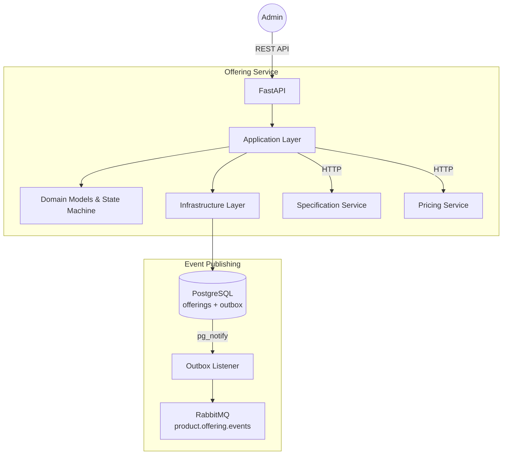

# Offering Service

## Overview
The Offering Service is the Aggregate Root for the Product Catalog system. it manages the full lifecycle of a Product Offering, coordinating with the Specification and Pricing services to ensure a valid and commercialized product is presented to the Store.

## Key Features
- **Lifecycle Management:** Implements a state machine (DRAFT -> PUBLISHING -> PUBLISHED -> RETIRED).
- **Cross-Service Validation:** Synchronously validates that referenced specifications and prices exist.
- **Transactional Outbox:** Ensures atomic state changes and reliable event publishing.
- **Saga Orchestrator (Future):** Will act as the initiator for the multi-step publication process.

## Architecture
The service follows Clean Architecture principles.

## Tech Stack
- **Framework:** FastAPI
- **Database:** PostgreSQL
- **ORM:** SQLAlchemy
- **Migrations:** Alembic
- **Messaging:** RabbitMQ (via `common-python`)
- **Validation:** Pydantic
- **Security:** JWT/RBAC (via `common-python`)

## Domain Model
- `ProductOffering`:
    - `id` (UUID)
    - `name` (string)
    - `description` (string)
    - `specification_ids` (List[UUID])
    - `pricing_ids` (List[UUID])
    - `sales_channels` (List[string])
    - `lifecycle_status` (Enum: DRAFT, PUBLISHING, PUBLISHED, RETIRED)
    - `created_at`, `updated_at`, `published_at`, `retired_at`

## API Endpoints
- `POST /api/v1/offerings`: Create a draft offering.
- `GET /api/v1/offerings/{id}`: Retrieve offering details.
- `GET /api/v1/offerings`: List offerings with pagination.
- `PUT /api/v1/offerings/{id}`: Update draft offering (restricted to DRAFT).
- `DELETE /api/v1/offerings/{id}`: Delete draft offering (restricted to DRAFT).
- `POST /api/v1/offerings/{id}/publish`: Initiate publication (transitions to PUBLISHED for now).
- `POST /api/v1/offerings/{id}/retire`: Retire a published offering.

## Event Topics Published
- `product.offering.events`:
    - `OfferingCreated`
    - `OfferingUpdated`
    - `OfferingPublicationInitiated`
    - `OfferingPublished`
    - `OfferingPublicationFailed`
    - `OfferingRetired`
