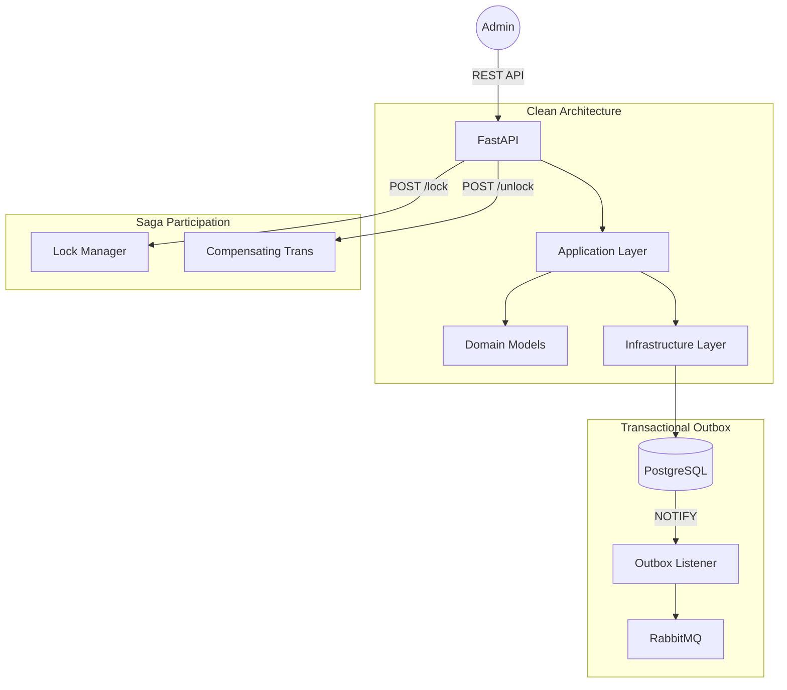

# Pricing Service

The **Pricing Service** manages commercial definitions (prices) for the TMF Product Catalog. It supports distributed transactions via a locking mechanism required for Saga orchestration.

## Architecture



## Tech Stack
- **Language:** Python 3.12+
- **Framework:** FastAPI
- **ORM:** SQLAlchemy 2.0
- **Messaging:** `aio-pika` (RabbitMQ)
- **Database:** PostgreSQL
- **Migrations:** Alembic

## Key Patterns
- **Transactional Outbox:** Guaranteed event delivery for all price changes.
- **Optimistic Locking:** Ensures data integrity during concurrent updates.
- **Saga Locking:** Provides `lock` and `unlock` primitives for distributed consistency.
- **Clean Architecture:** Strict separation of domain logic from infrastructure.

## Local Development

**Via Root Makefile:**
```bash
make dev
```

**Manual:**
```bash
cd services/pricing-service
uv run uvicorn pricing.main:app --port 8004
```
