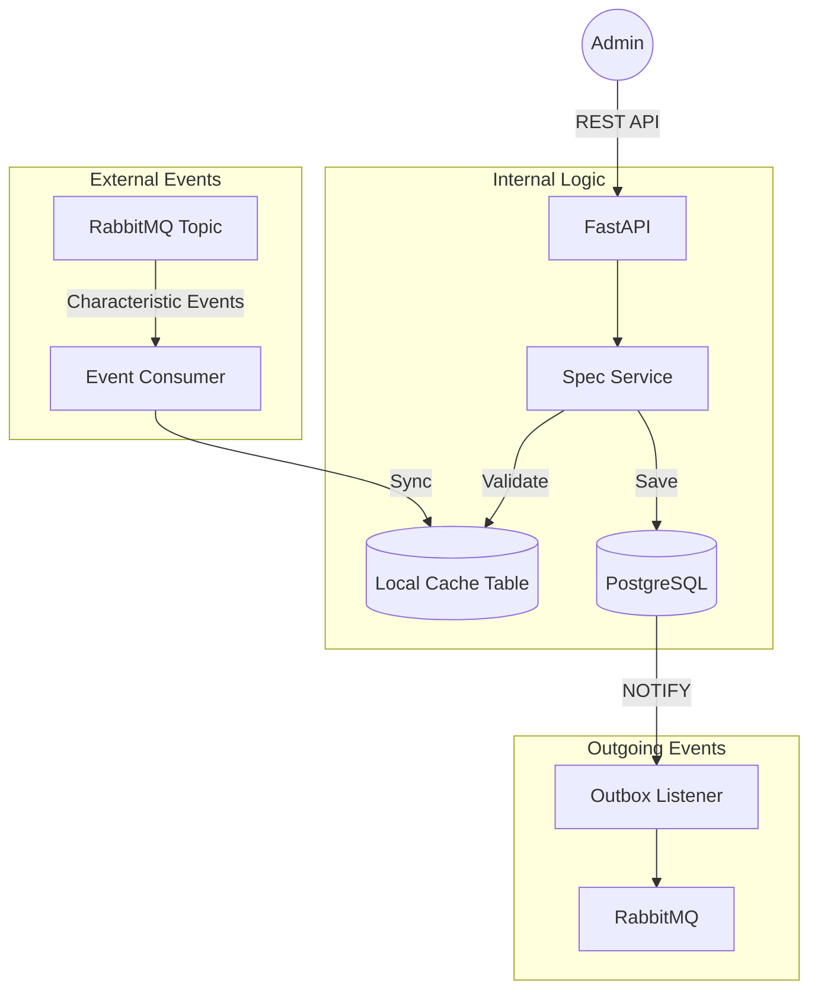

# Specification Service

The **Specification Service** defines technical collections of characteristics. It demonstrates advanced microservice patterns such as **Eventual Consistency** via a local reference cache and the **Transactional Outbox**.

## Architecture



## Tech Stack
- **Language:** Python 3.13+
- **Framework:** FastAPI
- **ORM:** SQLAlchemy 2.0
- **Messaging:** `aio-pika` (RabbitMQ)
- **Database:** PostgreSQL
- **Migrations:** Alembic

## Key Patterns
- **Local Reference Cache:** Stores Characteristic IDs locally to ensure service autonomy and sub-millisecond validation.
- **Eventual Consistency:** Subscribes to external domain events to keep the local cache in sync.
- **Transactional Outbox:** Atomically persists business data and domain events.
- **Clean Architecture:** Domain-driven design with decoupled layers.

## Local Development

**Via Root Makefile:**
```bash
make dev
```

**Manual:**
```bash
cd services/specification-service
uv run uvicorn src.main:app --port 8003
```
