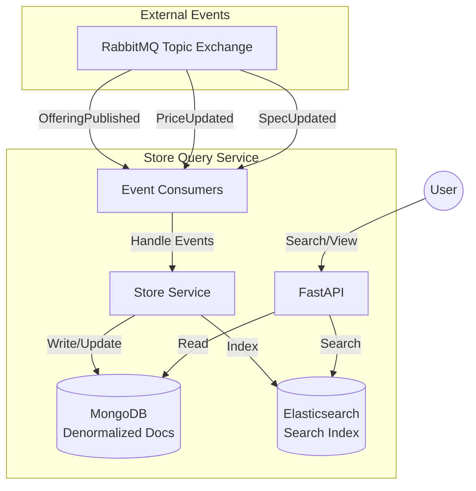

# Store Query Service

## Overview
The Store Query Service is the read-side of the CQRS pattern in the TMF Product Catalog system. It provides a highly optimized, denormalized, and searchable view of published product offerings. It synchronizes data from other services using an event-driven approach.

## Key Features
- **CQRS Read Model:** Maintains a denormalized view of offerings in MongoDB.
- **Advanced Search:** Integrated with Elasticsearch for full-text search and faceted filtering.
- **Event-Driven Synchronization:** Consumes events from RabbitMQ to keep the read model up-to-date.
- **Data Composition:** Aggregates data from Offering, Specification, pricing, and Characteristic services.
- **Idempotency:** Ensures that events are processed exactly once.

## Architecture
The service follows a CQRS and Event-Driven architecture.

## Tech Stack
- **Framework:** FastAPI
- **Primary Store:** MongoDB (via `motor`)
- **Search Engine:** Elasticsearch
- **Messaging:** RabbitMQ (via `aio-pika`)
- **Composition:** Asynchronous HTTP calls (via `httpx`)

## API Endpoints
- `GET /api/v1/store/offerings`: List all published offerings (paginated).
- `GET /api/v1/store/offerings/{id}`: Get details of a single offering.
- `GET /api/v1/store/search`: Search offerings with filters:
    - `q`: Full-text search across name, description, etc.
    - `min_price`, `max_price`: Price range filters.
    - `channel`: Filter by sales channel.

## Synchronization Logic
The service reacts to the following events:
- `OfferingPublished`: Triggers a full data composition and indexing.
- `OfferingRetired`: Removes the offering from both stores.
- `CharacteristicUpdated`, `SpecificationUpdated`, `PriceUpdated`: Finds all affected offerings and triggers a full re-composition for each to ensure data consistency.
